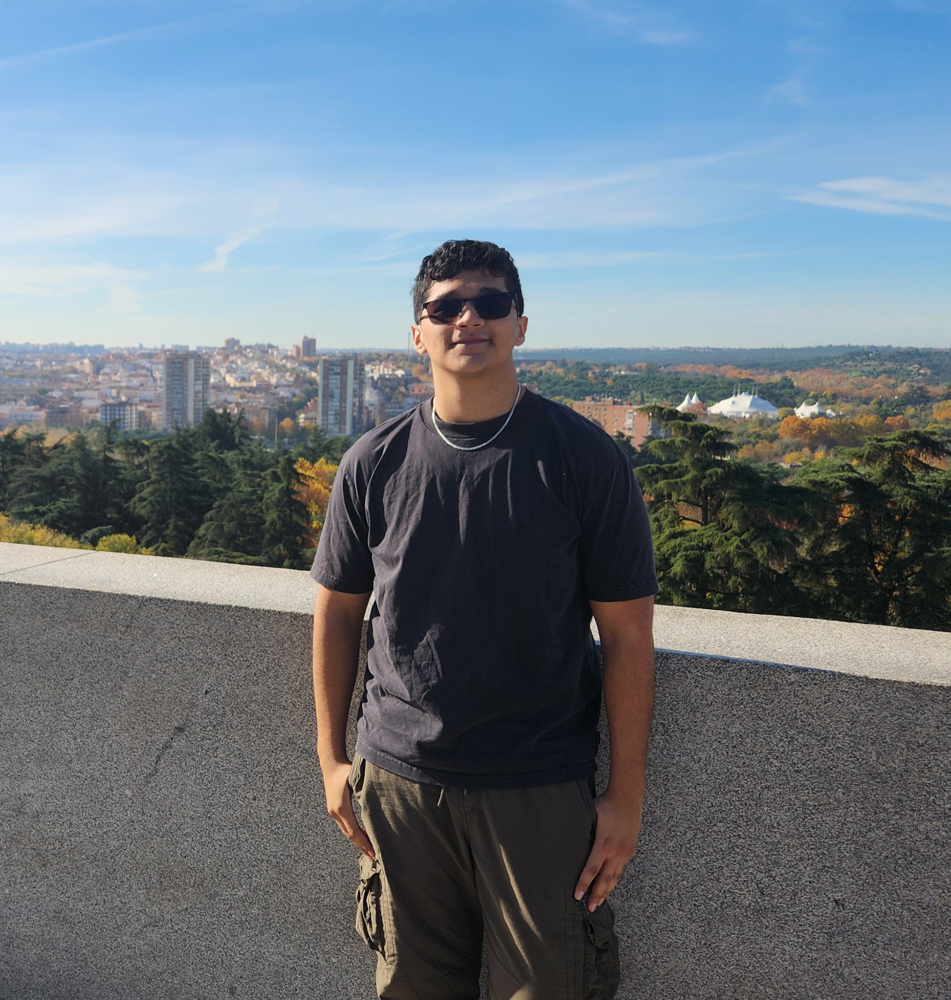

### Project/Labs 
* * *

| Skills             | Associated Project/Labs |
|:-------------------|:------------------------|
| Wiresshark         | Cuckoo Sandbox          |
| Linux Command Line | Virustotal              |
| Active Directory   | metasploit              |
| Sysmon             | Azure Security Center   |
| Powershell         | Volatility              |

### Familiar Tools
* * *

|                    |                       |         |         |
|:-------------------|:----------------------|:--------|:--------|
| Wiresshark         | Cuckoo Sandbox        | SPLUNK  | Autopsy |
| Linux Command Line | Virustotal            | OSquery | Tcpdump |
| Active Directory   | metasploit            | MISP    | Slack   |
| Sysmon             | Azure Security Center | NMAP    | Openvas |
| Powershell         | Volatility            | RDP     | TheHIVE |

### Certification
* * * 

*   CompTIA Security+
*   CS50x Introduction to Computer Science
*   TryHackMe SOC Level 1
*   Google IT Support
*   Google Cybersecurity 

### Link
[Link to another page](./another-page.html).

### Small image

### Large image

